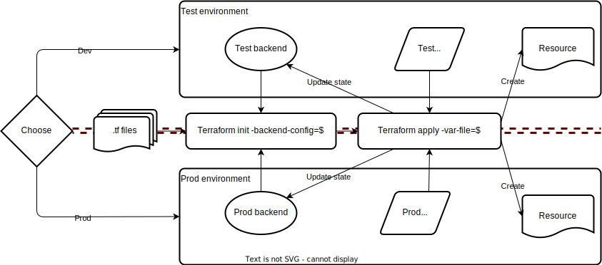
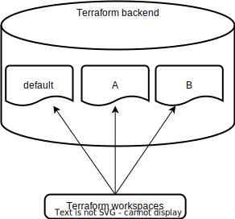

# Terraform backends

A terraform backend defines how and where the Terraform state file is stored.
The state file contains the mapping between a Terraform configuration, defined in .tf files,
and the real world resources. This is usually done with a unique identifier, resourceID, file path
or equivalent.

## Separated backends

### Default local storage

By default the state file is stored in the same directory as .tf files

Basic backend configuration

```hcl
terraform {
  backend "local" {
  }
}
```

```bash
# Init without any options specified
terraform init
```

```bash
# Creates state file in the current directory
❯ tree -L 1
.
├── terraform.tfstate
├── main.tf
└──
```

### Targeting multiple environment using different Terraform backends

Terraform code can be reused to create resources in different environment with small differences.

Examples:

* Dev, test and production infrastructure
  * Reduce resources and save cost in dev and test
* Multiple accounts/subscriptions/projects

Problems that multiple backends solve:

* Terraform code, .tf, can remain the same
* Backends is totally separated
  * Access control for each backend
    * Decreasing security risks
    * Limited blast radius
  * Enforce pipelines for important environments

When initializing a Terraform backend its possible to specify variables on how it should be stored.
This is done using `--backend-config=` argument.

When running plan and apply, variables from the relevant environment is loaded.
In this example using variables from `test` will result in different file name and content compared to `prod`



To separate test and production environment state can be managed in the following ways:

#### Test environment

Create backend using variables from [test](./variables/test/backend.tfvars)

```bash
terraform init -backend-config=environments/test/backend.tfvars
```

Run `terraform apply` to create resources

```bash
terraform apply -var-file=environments/test/variables.tfvars
```

#### Prod environment

Create backend using variables from [prod](./variables/test/backend.tfvars)

```bash
terraform init -backend-config=environments/prod/backend.tfvars
```

```bash
terraform apply -var-file=environments/prod/variables.tfvars
```

## Workspaces

NB! Terraform CLI workspaces != Terraform Cloud Workspaces!

Terraform CLI workspaces allow backends to be further split. A default workspace is created when a Terraform init is done for the first time



```bash
# List workspaces
❯ terraform workspace list
* default
```

### Create workspace

Create two workspaces, one for `a` and one for `b`

```bash
terraform workspace new a
terraform workspace new b
```

```bash
# List workspaces
❯ terraform workspace list
  default
  a
* b
```

Switch to workspace `a` and create resources.
Specify an extra parameter `-var workspace_name=X` to show how workspaces can be used to differentiate resources

### Apply

```bash
terraform workspace select a
terraform apply -var-file=environments/test/variables.tfvars -var workspace_name=a
```

Switch to workspace `b` and create resources.

```bash
terraform workspace select b
terraform apply -var-file=environments/test/variables.tfvars -var workspace_name=b
```

Notice how the workspaces manage their own resources, similar to separate states

```bash
❯ tree -L 1
.
├── environment-test_workspace-a_file.txt
└── environment-test_workspace-b_file.txt
```

## Backend and workspaces comparison

|                     | Separate Backends                   | Workspaces                                                                                                                    |
| ------------------- | ----------------------------------- | ----------------------------------------------------------------------------------------------------------------------------- |
| Access control      | Can be configured for each backend  | Access to one backend gives access to all workspaces                                                                          |
| Blast radius        | Can be limited                      | 100% dependant on users                                                                                                       |
| Creation complexity | Complex depending on access control | Easy, just requires a single backend                                                                                          |
| Usage complexity    | Simple, 1:1 mapping                 | Can become very complex depending on the amount of workspaces                                                                 |
| Use cases           | "Traditional" terraform             | Create many similar resources. Good for fire and forget situations where resources are not maintained after initial creation* |

## Challenge

1. What files are modified/deleted/created when changing backends?
2. What files needs to be modified when changing workspaces?
3. Create a development environment with file content `I am in a development environment, amazing`
